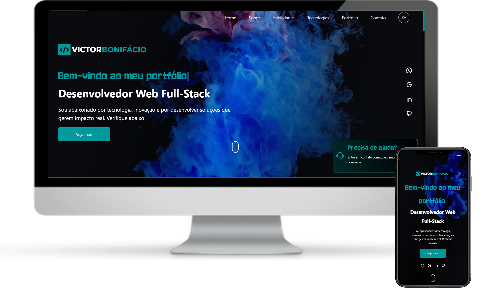

# Portfólio
Desenvolviemento de uma landing page responsiva construída em React com Styled-Components e bibliotecas auxiliares, priorizando semântica, performance e arquitetura de código limpa.

## 💻 Demonstração

🔗 [Acesse aqui a versão online](https://victorbonifacio.netlify.app/)

## ✨ Recursos

- React + Vite (Front-End)
- Yarn (Gerenciador de Pacotes)
- Styled-Components (Estilos)
- Bibliotecas
- Design responsivo
- Código limpo e organizado

## 📌 Observações

Este projeto foi desenvolvido com foco em criar uma presença digital e fortalecer minha experiência em desenvolvimento web, priorizando a aplicação de boas práticas em front-end.

## 📬 Contato

- [GitHub Profile](https://github.com/VictorBonifac10) 
- [LinkedIn](https://www.linkedin.com/in/victor-alves-bonifacio/)
